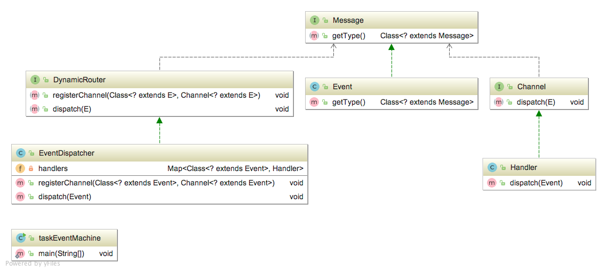

# Small-Large Tasks 
I used an event driven architectural pattern to implement a dynamic observer for 
concurrency over work stations.
## Motivation
Sometimes we have a broker such as rabbitMQ and
we want to distribute work among workers. The worker has two types of listeners:
  
<i>Small Tasks:</i>
This tag is assigned to those tasks which are not cpu intensive and
does not need to create an individual thread for each of them, so our event driver
architectures can register for this tag and dispatches the appropriate event handler.
The event handler can use a thread pool to do the task.
  
<i>Large Tasks:</i>
This tag is assigned to very time consuming tasks. A good idea is 
to create a new thread and terminate the thread whenever
it is complete.

 
Step1: 

 
 
After successfull compilation: 
from server1:a large task is received 
from server2:a large task is received 
from server1:simple calculation! a small task is received 
from server2:quick translation! a small task is received 
from server1:quick speech recognition! a small task is received 
from server1:a large task is received 

 
to be continued...